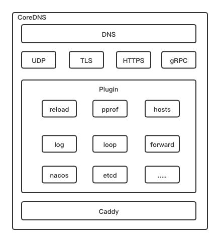
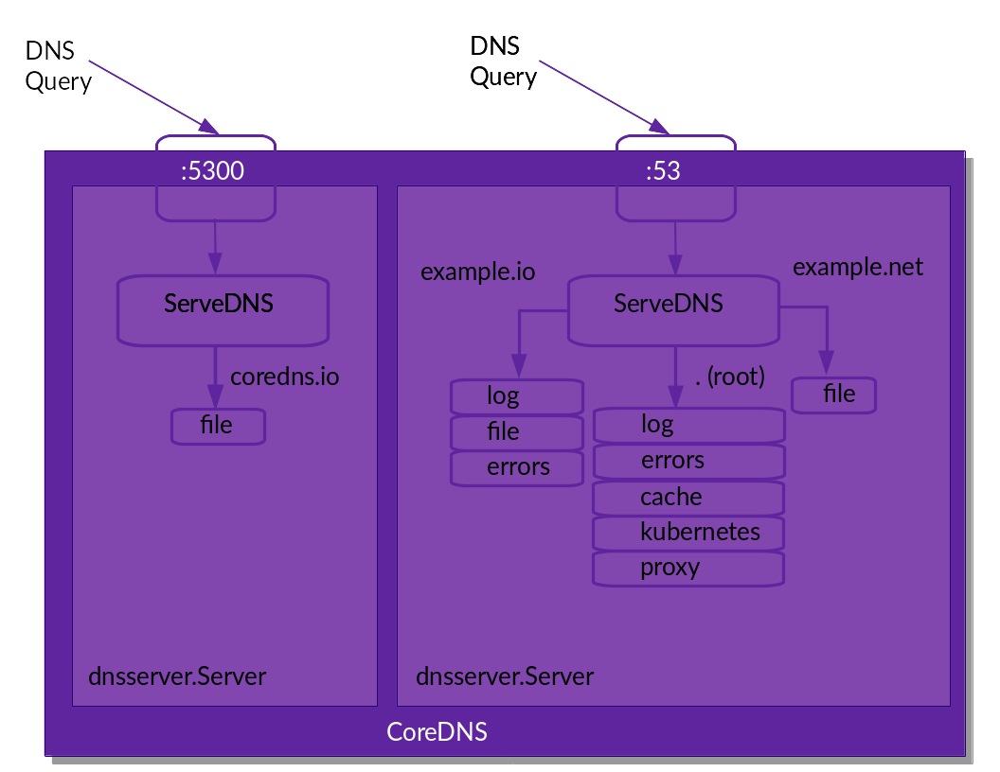

#### 什么是 CoreDNS

CoreDNS 不同与其它 DNS 服务，例如 BIND、Knot、PowerDNS 和 Unbound，从技术上来讲它也是一个解析器，但是值得一提的是，它非常的灵活，几乎所有的功能都通过外部插件来实现。

插件可以是独立的，也可以协同工作来执行“DNS功能”。

那么什么是“DNS功能”？有些插件本身并不创建响应，例如度量、缓存、健康检查或者日志等。还有一些插件确实会生成 DNS 响应。它们还可以做任何事情：有与Kubernetes通信以提供服务发现的插件，有从文件或数据库读取数据的插件。

#### 架构图

#### Caddy

Caddy 是一个强大的、可扩展的平台，可以为网站、服务和应用程序提供服务，它是用 Go 编写的。尽管大多数人将其用作web服务器或代理，但它是一个很好的选择：

- web服务器
- 反向代理
- 边车代理
- 负载均衡
- API网关
- 入口控制器
- 任务调度器

它主要工作在 L4 和 L7 作为接入层框架使用。

配置是动态的，并且可以通过 Caddy 的 API 导出。最受欢迎的配置 Caddy 的方法是使用 Caddyfile，因此 CoreDNS 的配置也使用 Caddyfile。

Caddy 为所有主要平台编译，并且没有运行时依赖项。

#### Plugin

一旦 CoreDNS 启动并解析了配置，它就会运行 DNS 服务。每个 DNS 服务都由其服务的区域和端口定义。每个 DNS 服务都有自己的插件链。

每个 DNS 服务允许指定一定数量的插件，这些插件以责任链模式链接到该 DNS 服务。大多数插件允许使用参数进行更多配置。

当 CoreDNS 处理查询时，将执行以下步骤：

1. 如果配置了多个 DNS 服务在查询的端口上侦听，它将检查哪个服务器具有此查询的最明确的区域（最长后缀匹配）。例如，如果有两个服务器，一个是 example.org，一个是 a.example.org，查询的是 www.a.example.org，它将被路由到后者。
2. 一旦找到服务器，它将通过为此服务器配置的插件链路由。这总是以同样的顺序发生。这个（静态）顺序是在 plugin.cfg 中定义的。
3. 每个插件将检查查询并决定是否应该处理它（一些插件允许你进一步过滤查询名称或其他属性）。

Caddyfile (在两个不同的端口上设置了 4 个区域)：
    
    coredns.io:5300 {
        file db.coredns.io
    }
    
    example.io:53 {
        log
        errors
        file db.example.io
    }
    
    example.net:53 {
        file db.example.net
    }
    
    .:53 {
        kubernetes
        forward . 8.8.8.8
        log
        errors
        cache
    }

CoreDNS 解析过程：

#### CoreDNS 能做什么？

1. 定制化 DNS 服务
2. 基于 DNS 实现服务发现

#### 参考：

- [微服务架构中基于DNS的服务注册与发现](https://nacos.io/zh-cn/blog/dns-sd.html)
- [CoreDNS](https://coredns.io/)
- [Caddy](https://caddyserver.com/docs/)
