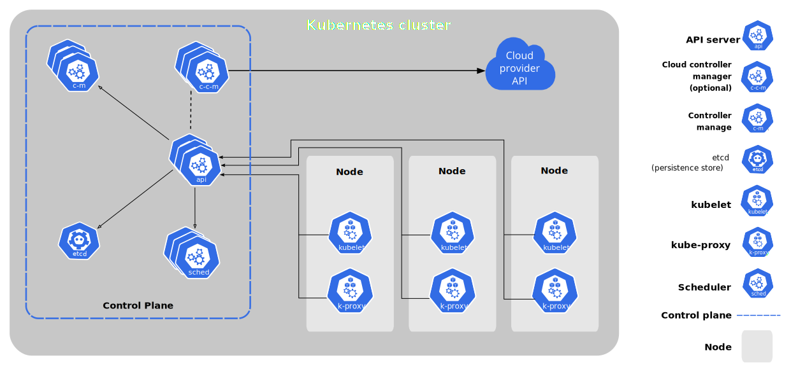

### Control Plane Components
The control plane's components make global decisions about the cluster (for example, scheduling), as well as detecting and responding to cluster events (for example, starting up a new pod when a deployment's replicas field is unsatisfied).

Control plane components can be run on any machine in the cluster. However, for simplicity, set up scripts typically start all control plane components on the same machine, and do not run user containers on this machine. See Building High-Availability Clusters for an example multi-master-VM setup.

#### kube-apiserver
The API server is a component of the Kubernetes control plane that exposes the Kubernetes API. The API server is the front end for the Kubernetes control plane.

The main implementation of a Kubernetes API server is kube-apiserver. kube-apiserver is designed to scale horizontally—that is, it scales by deploying more instances. You can run several instances of kube-apiserver and balance traffic between those instances.

#### etcd
Consistent and highly-available key value store used as Kubernetes' backing store for all cluster data.

If your Kubernetes cluster uses etcd as its backing store, make sure you have a back up plan for those data.

#### kube-scheduler
Control plane component that watches for newly created Pods with no assigned node, and selects a node for them to run on.

Factors taken into account for scheduling decisions include: individual and collective resource requirements, hardware/software/policy constraints, affinity and anti-affinity specifications, data locality, inter-workload interference, and deadlines.

#### kube-controller-manager
Control Plane component that runs controller processes.

Logically, each controller is a separate process, but to reduce complexity, they are all compiled into a single binary and run in a single process.

Some types of these controllers are:

- Node controller: Responsible for noticing and responding when nodes go down.
- Job controller: Watches for Job objects that represent one-off tasks, then creates Pods to run those tasks to completion.
- Endpoints controller: Populates the Endpoints object (that is, joins Services & Pods).
- Service Account & Token controllers: Create default accounts and API access tokens for new namespaces.

### Node Components
Node components run on every node, maintaining running pods and providing the Kubernetes runtime environment.

#### kubelet
An agent that runs on each node in the cluster. It makes sure that containers are running in a Pod.

The kubelet takes a set of PodSpecs that are provided through various mechanisms and ensures that the containers described in those PodSpecs are running and healthy. The kubelet doesn't manage containers which were not created by Kubernetes.

#### kube-proxy
kube-proxy is a network proxy that runs on each node in your cluster, implementing part of the Kubernetes Service concept.

kube-proxy maintains network rules on nodes. These network rules allow network communication to your Pods from network sessions inside or outside of your cluster.

kube-proxy uses the operating system packet filtering layer if there is one and it's available. Otherwise, kube-proxy forwards the traffic itself.

#### Container runtime
The container runtime is the software that is responsible for running containers.

Kubernetes supports several container runtimes: Docker, containerd, CRI-O, and any implementation of the Kubernetes CRI (Container Runtime Interface).

