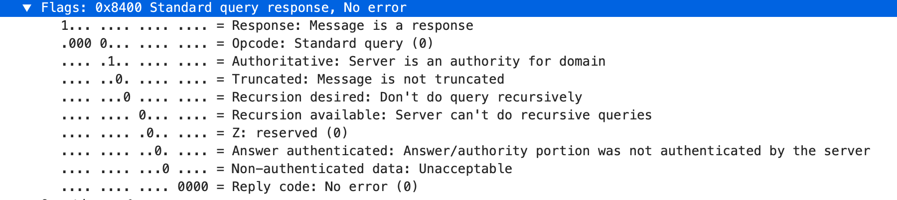
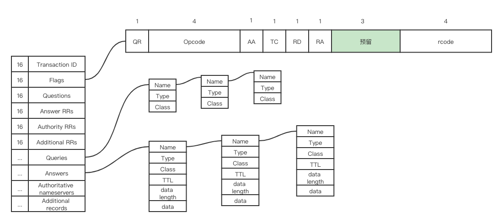

### 什么是DNS？

域名系统 (DNS) 是 Internet 电话簿。DNS 将域名转换为 IP 地址，以便加载 Internet 资源。

### 4 个 DNS 服务器

- DNS 解析器 - 该解析器可被视为被要求去图书馆的某个地方查找特定图书的图书馆员。DNS 解析器是 DNS 查找的第一站，其负责与发出初始请求的客户端打交道，解析器一般负责发出请求，以便满足客户端的 DNS 查询。
- 根域名服务器 - 是将人类可读的主机名转换（解析）为 IP 地址的第一步。可将其视为指向不同书架的图书馆中的索引 - 一般其作为对其他更具体位置的引用。
- TLD 域名服务器 - 顶级域服务器（TLD）可被视为图书馆中的特定书架。此域名服务器是搜索特定 IP 地址的下一步，其托管主机名的最后一部分（在 example.com 中，TLD 服务器为 “com”）。
- 权威性域名服务器 - 可将这个最终域名服务器视为书架上的字典。权威性域名服务器是域名服务器查询中的最后一站。如果权威性域名服务器能够访问请求的记录，则其会将已请求主机名的 IP 地址返回到发出初始请求的 DNS 解析器（图书管理员）。

### DNS 查找的 8 个步骤(无缓存)

1. 用户在 Web 浏览器中键入 “xesv5.com”，查询传输到 Internet 中，并被 DNS 递归解析器接收。
2. 接着，解析器查询 DNS 根域名服务器（.）。
3. 然后，根服务器使用存储其域信息的顶级域（TLD）DNS 服务器（例如 .com 或 .net）的地址响应该解析器。在搜索 xesv5.com 时，我们的请求指向 .com TLD。
4. 然后，解析器向 .com TLD 发出请求。
5. TLD 服务器随后使用该域的域名服务器 xesv5.com 的 IP 地址进行响应。
6. 最后，递归解析器将查询发送到域(xesv5)的域名服务器。
7. example.com 的 IP 地址而后从域名服务器返回解析器。
8. 然后 DNS 解析器使用最初请求的域的 IP 地址响应 Web 浏览器。

### DNS 查询类型

1. 递归查询 - 在递归查询中，DNS 客户端要求 DNS 服务器（一般
为 DNS 递归解析器）将使用所请求的资源记录响应客户端，或者如果解
析器无法找到该记录，则返回错误消息。
2. 迭代查询 - 在这种情况下，DNS 客户端将允许 DNS 服务器返回其能
够给出的最佳应答。如果所查询的 DNS 服务器与查询名称不匹配，则其将
返回对较低级别域名空间具有权威性的 DNS 服务器的引用。然后，DNS 客
户端将对引用地址进行查询。此过程继续使用查询链中的其他 DNS 服务
器，直至发生错误或超时为止。
3. 非递归查询 - 当 DNS 解析器客户端查询 DNS 服务器以获取其有权访
问的记录时通常会进行此查询，因为其对该记录具有权威性，或者该记录存
在于其缓存内。DNS 服务器通常会缓存 DNS 记录，以防止更多带宽消耗
和上游服务器上的负载。

### DNS 缓存

DNS 数据可缓存到各种不同的位置上，每个位置均将存储 DNS 记录并保存
由生存时间（TTL）决定的一段时间。

#### 浏览器 DNS 缓存
现代 Web 浏览器设计为默认将 DNS 记录缓存一段时间

#### 操作系统（OS）级 DNS 缓存

操作系统级 DNS 解析器是 DNS 查询离开计算机前的第二站，也是本地最后
一站。操作系统内旨在处理此查询的过程通常称为“存根解析器”或 DNS 客
户端。当存根解析器获取来自某个应用程序的请求时，其首先检查自己的缓
存，以便查看是否有此记录。如果没有，则将本地网络外部的 DNS 查询
发送到 Internet 服务提供商内部的 DNS 递归解析器。

与先前所有步骤一样，当内的递归解析器收到 DNS 查询时，其还将
查看所请求的主机到 IP 地址转换是否已经存储在其本地持久性层中。

### DNS 记录

DNS记录是存在于权威DNS服务器中的说明，提供有关域的信息，包括与
该域关联的IP地址以及如何处理该域的请求。

#### 最常见的 DNS 记录

- A 记录 - 保存域的 IP 地址的记录。
- CNAME 记录 - 将一个域或子域转发到另一个域，不提供 IP 地址。
- MX 记录 - 将邮件定向到电子邮件服务器。
- TXT 记录 - 可使管理员在记录中存储文本注释。
- NS 记录 - 哪个 DNS 服务器对该域具有权威性。
- SOA 记录 - 存储域的管理信息。
- SRV 记录 - 指定用于特定服务的端口。
- PTR 记录 - 在反向查询中提供域名。

### 什么是 DNS 区域？

DNS被分成许多不同的区域。这些区域区分DNS命名空间中的不同管理区
域。DNS区域是由特定组织或管理员管理的DNS命名空间的一部分。DNS区
域是一个管理空间，允许对DNS组件（如权威名称服务器）进行更精确的
控制。域名空间是一个层次结构树，DNS根域位于顶部。DNS区域从树中
的域开始，也可以向下扩展到子域，这样多个子域就可以由一个实体管理。

一个常见错误是将 DNS 区域与域名或单个 DNS 服务器关联。实际
上，DNS 区域可包含多个子域，并且多个区域可存在于同一服务器上。

### 为什么只有13个DNS根服务器地址？

一个常见的误解是世界上只有13个根服务器。实际上，还有更多的IP地址，但
仍然只有13个IP地址用于查询不同的根服务器网络。DNS原始体系结构的限制
要求根区域中最多有13个服务器地址。在互联网早期，13个IP地址中的每一个
只有一台服务器，其中大部分位于美国。

UDP 包大多限制在512字节，当查询根域的NS记录时，为了了在一个报⽂文中
传完响应，512字节只够返回包含13个根域名服务器器的NS记录和A记录

如今，这13个IP地址中的每一个都有多个服务器，这些服务器使用选播路由根
据负载和接近度来分发请求。现在有超过600个不同的DNS根服务器分布在地球
上每个人口稠密的大陆。

### 解析程序如何找到DNS根服务器？

由于DNS根区域位于DNS层次结构的顶部，因此无法在DNS查找中将递归解析程
序定向到它们。因此，每个DNS解析程序都在其软件中内置了一个包含13个IP
根服务器地址的列表。每当启动DNS查找时，递归器的第一次通信就是与这13
个IP地址中的一个进行通信。

### DNS 报文

DNS 报文分为 请求 和 应答 两种，结构是类似的，大致分为五部分：

- 头部( header )，描述报文类型，以及其下 4 个小节的情况;
- 问题节( question )，保存查询问题;
- 答案节( answer )，保存问题答案，也就是查询结果;
- 授权信息节( authority )，保存授权信息;
- 附加信息节( additional )，保存附加信息;

其中，头部是固定的，共 12 字节;其他节不固定，记录数可多可少，数目
保存在头部中。

- Transaction ID：报文的 事物ID 标识。对于请求报文和其对应的应答
报文，该字段的值是相同的。通过它可以区分 DNS 应答报文是对哪
个请求进行响应的。
- Flags：报文中的标志字段，扩展字段。
  - QR(8bit)：标记报文是一个查询请求，还是查询应答;
    - 0：查询请求;
    - 1：应答;
  - Opcode(32bit)：操作码，表示操作类型：
    - 0：标准查询;
    - 1：反向查询;
    - 2：服务器状态请求;
  - AA(1bit)：权威回答( authoritative answer )，意味着当前查
  询结果是由域名的权威服务器给出的;
  - TC(1bit)：截短( truncated )，使用 UDP 时，如果应答
  超过 512 字节，只返回前 512 个字节;
  - RD(1bit)：期望递归 ( recursion desired )，在请求
  中设置，并在应答中返回;
    - 1：服务器必须处理这个请求：如果服务器没有授权
    回答，它必须替客户端请求其他 DNS 服务器，这也是所谓
    的 递归查询 ;
    - 0：如果服务器没有授权回答，它就返回一个能够
    处理该查询的服务器列表给客户端，由客户端自己进行 迭代查询 ;
  - RA(1bit)：可递归( recursion available )，如果服务器支持递
  归查询，就会在应答中设置该位，以告知客户端;
  - 保留位：这 3 位目前未用，留作未来扩展;
  - rcode(32bit)：响应码，表示请求结果：
    - 0 表示没有差错;
- Questions：查询请求的问题计数。
- Answer RRs：问题对应的答案记录的数目。
- Authority RRs：权威域名服务器记录的数目。
- Additional RRs：额外的记录数目。
- Queries：查询请求的问题的详细内容
- Answers：问题对应的答案的详细内容
- Authoritative nameservers：权威域名服务器的详细内容
- Additional records：额外记录的详细内容（记录权威名称服务
器对应 IP 地址和协议的扩展信息）

### 什么是 EDNS ？
EDNS就是在遵循已有的DNS消息格式的基础上增加一些字段，来支持更多
的DNS请求业务。

为了保持向后兼容性，更改已有的DNS协议格式是不可能的，所以只能
在DNS协议的数据部分中做文章。

EDNS中引入了一种新的伪资源记录OPT（Resource Record），之所以叫
做伪资源记录是因为它不包含任何DNS数据，OPT RR不能被cache、不能
被转发、不能被存储在zone文件中。OPT被放在DNS通信双
方（requestor和responsor）DNS消息的Additional data区域中。

OPT-RR可以放置在附加数据部分内的任何位置。
当OPT RR包含在任何DNS消息中时，它必须是
只有选择RR在那条消息里。如果查询消息包含多个
收到OPT RR时，必须返回FORMERR（RCODE=1）。这个
OPT-RR的布局灵活性并不超过
TSIG或SIG（0）RRs是附加部分中的最后一个
只要他们在场。

       +------------+--------------+------------------------------+
       | Field Name | Field Type   | Description                  |
       +------------+--------------+------------------------------+
       | NAME       | domain name  | MUST be 0 (root domain)      |
       | TYPE       | u_int16_t    | OPT (41)                     |
       | CLASS      | u_int16_t    | requestor's UDP payload size |
       | TTL        | u_int32_t    | extended RCODE and flags     |
       | RDLEN      | u_int16_t    | length of all RDATA          |
       | RDATA      | octet stream | {attribute,value} pairs      |
       +------------+--------------+------------------------------+

OPT-RR有一个固定的部分和一组可变的选项，表示为{属性，值}对。

   The variable part of an OPT RR may contain zero or more options in
   the RDATA.  Each option MUST be treated as a bit field.  Each option
   is encoded as:

                  +0 (MSB)                            +1 (LSB)
       +---+---+---+---+---+---+---+---+---+---+---+---+---+---+---+---+
    0: |                          OPTION-CODE                          |
       +---+---+---+---+---+---+---+---+---+---+---+---+---+---+---+---+
    2: |                         OPTION-LENGTH                         |
       +---+---+---+---+---+---+---+---+---+---+---+---+---+---+---+---+
    4: |                                                               |
       /                          OPTION-DATA                          /
       /                                                               /
       +---+---+---+---+---+---+---+---+---+---+---+---+---+---+---+---+

6.1.3.  OPT Record TTL Field Use

   The extended RCODE and flags, which OPT stores in the RR Time to Live
   (TTL) field, are structured as follows:

                  +0 (MSB)                            +1 (LSB)
       +---+---+---+---+---+---+---+---+---+---+---+---+---+---+---+---+
    0: |         EXTENDED-RCODE        |            VERSION            |
       +---+---+---+---+---+---+---+---+---+---+---+---+---+---+---+---+
    2: | DO|                           Z                               |
       +---+---+---+---+---+---+---+---+---+---+---+---+---+---+---+---+

### CDN

### 微服务架构中基于 DNS 的服务注册发现

DNS协议是目前最为通用的协议之一，几乎所有操作系统都会有DNS客户
端实现。所以，其天然具有跨语言特性。这也是快速接入微服务体系最快
的一个方式。要基于DNS做服务发现，首先注册中心的数据应该可以
以DNS的数据格式暴露出来，让任何系统的 DNS 客户端都可以通过DNS协
议获取服务列表。

#### 名字服务的实现

- TCM: 配置中心
- HDFS: 文件系统，名字服务的后端存储
- tns-server: 名字服务的后端
- tns-address: 地址服务，记录名字服务的集群信息
- tns-probe: 探活服务，管理非 k8s 环境下的服务的节点状态
- tns-gateway: 名字服务的网关，用于路由和分组
- tns-proxy: dns 服务
- nacos-sync: 用于名字服务间同步数据
- SDK：名字服务的接入方式的一种，目前支持 Go、java
- open-api: 以 http 方式接入名字服务
- console: 名字服务的控制台
- localdns: 本地 DNS 解析器

