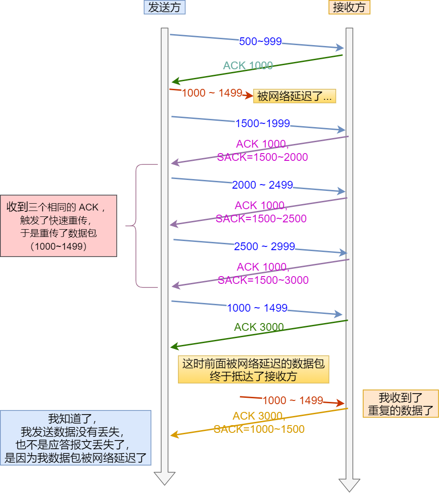
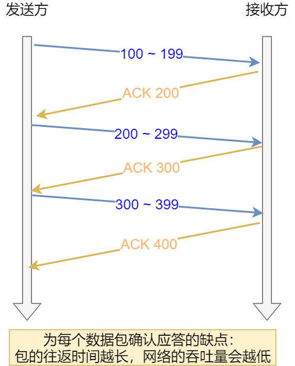
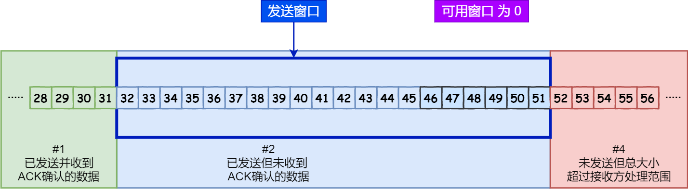
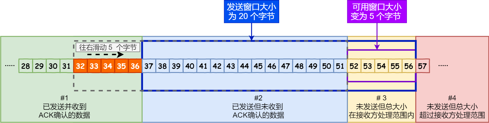
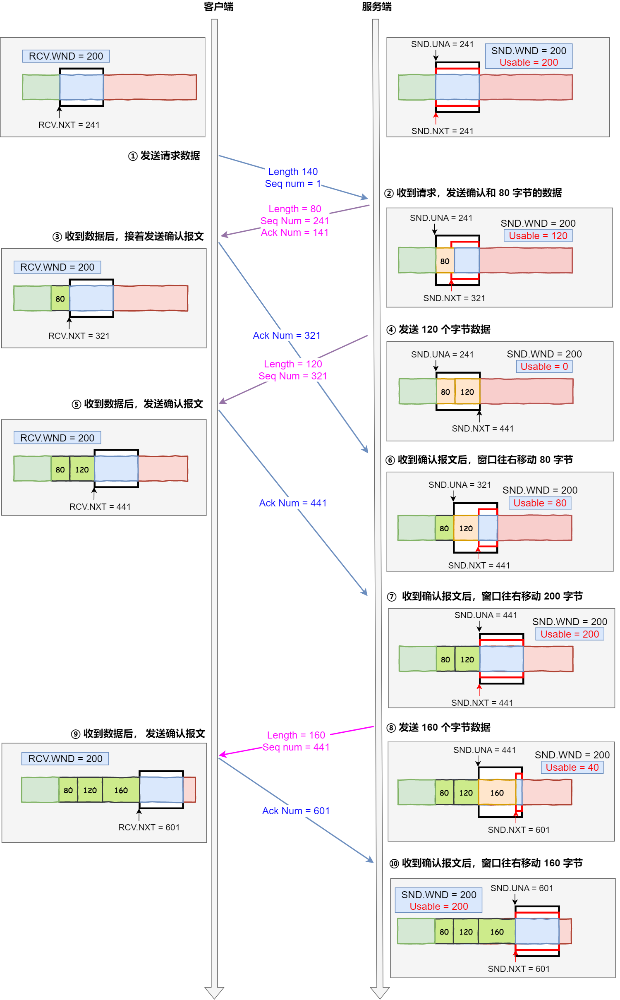
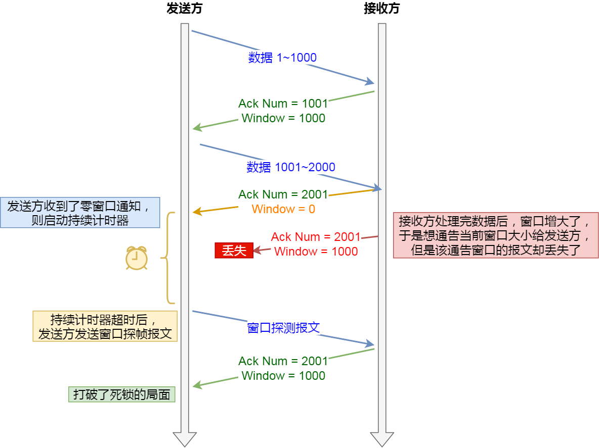

#### 重传机制

##### 超时重传

重传机制的其中一个方式，就是在发送数据时，设定一个定时器，当超过指定的时间后，没有收到对方的 ACK 确认应答报文，就会重发该数据，也就是我们常说的超时重传。

TCP 会在以下两种情况发生超时重传：
- 数据包丢失
- 确认应答丢失

RTT（Round-Trip Time 往返时延），从发送SYN到接收到ACK的时间间隔，数据从网络一端传输到另一端所需的时间，也就是包的往返时间。

 RTO （Retransmission Timeout 超时重传时间），过多久没收到ACK就重新发包。

- 当超时时间 RTO 较大时，重发就慢，丢了老半天才重发，没有效率，性能差；
- 当超时时间 RTO 较小时，会导致可能并没有丢就重发，于是重发的就快，会增加网络拥塞，导致更多的超时，更多的超时导致更多的重发。

根据上述的两种情况，可以得知，超时重传时间 RTO 的值应该略大于报文往返 RTT 的值。

如果超时重发的数据，再次超时的时候，又需要重传的时候，TCP 的策略是超时间隔加倍。

也就是每当遇到一次超时重传的时候，都会将下一次超时时间间隔设为先前值的两倍。两次超时，就说明网络环境差，不宜频繁反复发送。

超时触发重传存在的问题是，超时周期可能相对较长。于是就可以用「快速重传」机制来解决超时重发的时间等待。

##### 快速重传

TCP 还有另外一种快速重传（Fast Retransmit）机制，它不以时间为驱动，而是以数据驱动重传。

例如发送方发出了 1，2，3，4，5 份数据：

1. 第一份 Seq1 先送到了，于是就 Ack 回 2；
2. 结果 Seq2 因为某些原因没收到，Seq3 到达了，于是还是 Ack 回 2；
3. 后面的 Seq4 和 Seq5 都到了，但还是 Ack 回 2，因为 Seq2 还是没有收到；
4. 发送端收到了三个 Ack = 2 的确认，知道了 Seq2 还没有收到，就会在定时器过期之前，重传丢失的 Seq2。
5. 最后，收到了 Seq2，此时因为 Seq3，Seq4，Seq5 都收到了，于是 Ack 回 6 。

所以，快速重传的工作方式是当收到三个相同的 ACK 报文时，会在定时器过期之前，重传丢失的报文段。

快速重传机制只解决了一个问题，就是超时时间的问题，但是它依然面临着另外一个问题。就是重传的时候，是重传之前的一个，还是重传所有的问题。

比如对于上面的例子，是重传 Seq2 呢？还是重传 Seq2、Seq3、Seq4、Seq5 呢？因为发送端并不清楚这连续的三个 Ack 2 是谁传回来的。

根据 TCP 不同的实现，以上两种情况都是有可能的。为了解决不知道该重传哪些 TCP 报文，于是就有 SACK 方法。

##### SACK 方法

SACK（ Selective Acknowledgment 选择性确认）。

这种方式需要在 TCP 头部「选项」字段里加一个 SACK 的东西，它可以将缓存的地图发送给发送方，这样发送方就可以知道哪些数据收到了，哪些数据没收到，知道了这些信息，就可以只重传丢失的数据。

如下图，发送方收到了三次同样的 ACK 确认报文，于是就会触发快速重发机制，通过 SACK 信息发现只有 200~299 这段数据丢失，则重发时，就只选择了这个 TCP 段进行重复。

如果要支持 SACK，必须双方都要支持。在 Linux 下，可以通过 net.ipv4.tcp_sack 参数打开这个功能（Linux 2.4 后默认打开）。

##### Duplicate SACK

Duplicate SACK 又称 D-SACK，其主要使用了 SACK 来告诉「发送方」有哪些数据被重复接收了。

1. ACK 丢包：

- 「接收方」发给「发送方」的两个 ACK 确认应答都丢失了，所以发送方超时后，重传第一个数据包（3000 ~ 3499）
- 于是「接收方」发现数据是重复收到的，于是回了一个 SACK = 3000~3500，告诉「发送方」 3000~3500 的数据早已被接收了，因为 ACK 都到了 4000 了，已经意味着 4000 之前的所有数据都已收到，所以这个 SACK 就代表着 D-SACK。
- 这样「发送方」就知道了，数据没有丢，是「接收方」的 ACK 确认报文丢了。

2. 网络延时

- 数据包（1000~1499） 被网络延迟了，导致「发送方」没有收到 Ack 1500 的确认报文。
- 而后面报文到达的三个相同的 ACK 确认报文，就触发了快速重传机制，但是在重传后，被延迟的数据包（1000~1499）又到了「接收方」；
- 所以「接收方」回了一个 SACK=1000~1500，因为 ACK 已经到了 3000，所以这个 SACK 是 D-SACK，表示收到了重复的包。
- 这样发送方就知道快速重传触发的原因不是发出去的包丢了，也不是因为回应的 ACK 包丢了，而是因为网络延迟了。

D-SACK 有这么几个好处：

- 可以让「发送方」知道，是发出去的包丢了，还是接收方回应的 ACK 包丢了;
- 可以知道是不是「发送方」的数据包被网络延迟了;
- 可以知道网络中是不是把「发送方」的数据包给复制了;

在 Linux 下可以通过 net.ipv4.tcp_dsack 参数开启/关闭这个功能（Linux 2.4 后默认打开）。

##### 滑动窗口

    引入窗口概念的原因
    
我们都知道 TCP 是每发送一个数据，都要进行一次确认应答。当上一个数据包收到了应答了， 再发送下一个。

这个模式就有点像我和你面对面聊天，你一句我一句。但这种方式的缺点是效率比较低的。

如果你说完一句话，我在处理其他事情，没有及时回复你，那你不是要干等着我做完其他事情后，我回复你，你才能说下一句话，很显然这不现实

数据包的往返时间越长，通信的效率就越低。

为解决这个问题，TCP 引入了窗口这个概念。即使在往返时间较长的情况下，它也不会降低网络通信的效率。

那么有了窗口，就可以指定窗口大小，窗口大小就是指无需等待确认应答，而可以继续发送数据的最大值。

窗口的实现实际上是操作系统开辟的一个缓存空间，发送方主机在等到确认应答返回之前，必须在缓冲区中保留已发送的数据。如果按期收到确认应答，此时数据就可以从缓存区清除。

假设窗口大小为 3 个 TCP 段，那么发送方就可以「连续发送」 3 个 TCP 段，并且中途若有 ACK 丢失，可以通过「下一个确认应答进行确认」。如下图：

用滑动窗口方式并行处理
图中的 ACK 600 确认应答报文丢失，也没关系，因为可以通过下一个确认应答进行确认，只要发送方收到了 ACK 700 确认应答，就意味着 700 之前的所有数据「接收方」都收到了。这个模式就叫累计确认或者累计应答。

    窗口大小由哪一方决定？
    
TCP 头里有一个字段叫 Window，也就是窗口大小。

这个字段是接收端告诉发送端自己还有多少缓冲区可以接收数据。于是发送端就可以根据这个接收端的处理能力来发送数据，而不会导致接收端处理不过来。

所以，通常窗口的大小是由接收方的窗口大小来决定的。

发送方发送的数据大小不能超过接收方的窗口大小，否则接收方就无法正常接收到数据。

    发送方的滑动窗口
    
我们先来看看发送方的窗口，下图就是发送方缓存的数据，根据处理的情况分成四个部分，其中深蓝色方框是发送窗口，紫色方框是可用窗口：

- 1 是已发送并收到 ACK确认的数据：1~31 字节
- 2 是已发送但未收到 ACK确认的数据：32~45 字节
- 3 是未发送但总大小在接收方处理范围内（接收方还有空间）：46~51字节
- 4 是未发送但总大小超过接收方处理范围（接收方没有空间）：52字节以后

在下图，当发送方把数据「全部」都一下发送出去后，可用窗口的大小就为 0 了，表明可用窗口耗尽，在没收到 ACK 确认之前是无法继续发送数据了。

在下图，当收到之前发送的数据 32~36 字节的 ACK 确认应答后，如果发送窗口的大小没有变化，则滑动窗口往右边移动 5 个字节，因为有 5 个字节的数据被应答确认，接下来 52~56 字节又变成了可用窗口，那么后续也就可以发送 52~56 这 5 个字节的数据了。

    接收方的滑动窗口
    

接收窗口相对简单一些，根据处理的情况划分成三个部分：

- 1 + 2 是已成功接收并确认的数据（等待应用进程读取）；
- 3 是未收到数据但可以接收的数据；
- 4 未收到数据并不可以接收的数据；

    接收窗口和发送窗口的大小是相等的吗？
    
并不是完全相等，接收窗口的大小是约等于发送窗口的大小的。

因为滑动窗口并不是一成不变的。比如，当接收方的应用进程读取数据的速度非常快的话，这样的话接收窗口可以很快的就空缺出来。那么新的接收窗口大小，是通过 TCP 报文中的 Windows 字段来告诉发送方。那么这个传输过程是存在时延的，所以接收窗口和发送窗口是约等于的关系。

##### 流量控制

发送方不能无脑的发数据给接收方，要考虑接收方处理能力。

如果一直无脑的发数据给对方，但对方处理不过来，那么就会导致触发重发机制，从而导致网络流量的无端的浪费。

为了解决这种现象发生，TCP 提供一种机制可以让「发送方」根据「接收方」的实际接收能力控制发送的数据量，这就是所谓的流量控制。

下面举个栗子，为了简单起见，假设以下场景：

- 客户端是接收方，服务端是发送方
- 假设接收窗口和发送窗口相同，都为 200
- 假设两个设备在整个传输过程中都保持相同的窗口大小，不受外界影响

根据上图的流量控制，说明下每个过程：

1. 客户端向服务端发送请求数据报文。这里要说明下，本次例子是把服务端作为发送方，所以没有画出服务端的接收窗口。
2. 服务端收到请求报文后，发送确认报文和 80 字节的数据，于是可用窗口 Usable 减少为 120 字节，同时 SND.NXT 指针也向右偏移 80 字节后，指向 321，这意味着下次发送数据的时候，序列号是 321。
3. 客户端收到 80 字节数据后，于是接收窗口往右移动 80 字节，RCV.NXT 也就指向 321，这意味着客户端期望的下一个报文的序列号是 321，接着发送确认报文给服务端。
4. 服务端再次发送了 120 字节数据，于是可用窗口耗尽为 0，服务端无法再继续发送数据。
5. 客户端收到 120 字节的数据后，于是接收窗口往右移动 120 字节，RCV.NXT 也就指向 441，接着发送确认报文给服务端。
6. 服务端收到对 80 字节数据的确认报文后，SND.UNA 指针往右偏移后指向 321，于是可用窗口 Usable 增大到 80。
7. 服务端收到对 120 字节数据的确认报文后，SND.UNA 指针往右偏移后指向 441，于是可用窗口 Usable 增大到 200。
8. 服务端可以继续发送了，于是发送了 160 字节的数据后，SND.NXT 指向 601，于是可用窗口 Usable 减少到 40。
9. 客户端收到 160 字节后，接收窗口往右移动了 160 字节，RCV.NXT 也就是指向了 601，接着发送确认报文给服务端。
10. 服务端收到对 160 字节数据的确认报文后，发送窗口往右移动了 160 字节，于是 SND.UNA 指针偏移了 160 后指向 601，可用窗口 Usable 也就增大至了 200。

##### 操作系统缓冲区与滑动窗口的关系

前面的流量控制例子，我们假定了发送窗口和接收窗口是不变的，但是实际上，发送窗口和接收窗口中所存放的字节数，都是放在操作系统内存缓冲区中的，而操作系统的缓冲区，会被操作系统调整。

当应用进程没办法及时读取缓冲区的内容时，也会对我们的缓冲区造成影响。

    那操心系统的缓冲区，是如何影响发送窗口和接收窗口的呢？
    
当应用程序没有及时读取缓存时，发送窗口和接收窗口的变化。

- 客户端作为发送方，服务端作为接收方，发送窗口和接收窗口初始大小为 360；
- 服务端非常的繁忙，当收到客户端的数据时，应用层不能及时读取数据。

1. 客户端发送 140 字节数据后，可用窗口变为 220 （360 - 140）。
2. 服务端收到 140 字节数据，但是服务端非常繁忙，应用进程只读取了 40 个字节，还有 100 字节占用着缓冲区，于是接收窗口收缩到了 260 （360 - 100），最后发送确认信息时，将窗口大小通告给客户端。
3. 客户端收到确认和窗口通告报文后，发送窗口减少为 260。
4. 客户端发送 180 字节数据，此时可用窗口减少到 80。
5. 服务端收到 180 字节数据，但是应用程序没有读取任何数据，这 180 字节直接就留在了缓冲区，于是接收窗口收缩到了 80 （260 - 180），并在发送确认信息时，通过窗口大小给客户端。
6. 客户端收到确认和窗口通告报文后，发送窗口减少为 80。
7. 客户端发送 80 字节数据后，可用窗口耗尽。
8. 服务端收到 80 字节数据，但是应用程序依然没有读取任何数据，这 80 字节留在了缓冲区，于是接收窗口收缩到了 0，并在发送确认信息时，通过窗口大小给客户端。
9. 客户端收到确认和窗口通告报文后，发送窗口减少为 0。

可见最后窗口都收缩为 0 了，也就是发生了窗口关闭。当发送方可用窗口变为 0 时，发送方实际上会定时发送窗口探测报文，以便知道接收方的窗口是否发生了改变.

当服务端系统资源非常紧张的时候，操心系统可能会直接减少了接收缓冲区大小，这时应用程序又无法及时读取缓存数据，那么这时候就有严重的事情发生了，会出现数据包丢失的现象。

1. 客户端发送 140 字节的数据，于是可用窗口减少到了 220。
2. 服务端因为现在非常的繁忙，操作系统于是就把接收缓存减少了 120 字节，当收到 140 字节数据后，又因为应用程序没有读取任何数据，所以 140 字节留在了缓冲区中，于是接收窗口大小从 360 收缩成了 100，最后发送确认信息时，通告窗口大小给对方。
3. 此时客户端因为还没有收到服务端的通告窗口报文，所以不知道此时接收窗口收缩成了 100，客户端只会看自己的可用窗口还有 220，所以客户端就发送了 180 字节数据，于是可用窗口减少到 40。
4. 服务端收到了 180 字节数据时，发现数据大小超过了接收窗口的大小，于是就把数据包丢失了。
5. 客户端收到第 2 步时，服务端发送的确认报文和通告窗口报文，尝试减少发送窗口到 100，把窗口的右端向左收缩了 80，此时可用窗口的大小就会出现诡异的负值。

如果发生了先减少缓存，再收缩窗口，就会出现丢包的现象。

为了防止这种情况发生，TCP 规定是不允许同时减少缓存又收缩窗口的，而是采用先收缩窗口，过段时间再减少缓存，这样就可以避免了丢包情况。

##### 窗口关闭

TCP 通过让接收方指明希望从发送方接收的数据大小（窗口大小）来进行流量控制。

如果窗口大小为 0 时，就会阻止发送方给接收方传递数据，直到窗口变为非 0 为止，这就是窗口关闭。

    窗口关闭潜在的危险
    
接收方向发送方通告窗口大小时，是通过 ACK 报文来通告的。

那么，当发生窗口关闭时，接收方处理完数据后，会向发送方通告一个窗口非 0 的 ACK 报文，如果这个通告窗口的 ACK 报文在网络中丢失了，那麻烦就大了。

这会导致发送方一直等待接收方的非 0 窗口通知，接收方也一直等待发送方的数据，如不采取措施，这种相互等待的过程，会造成了死锁的现象。

    TCP 是如何解决窗口关闭时，潜在的死锁现象呢？
    
为了解决这个问题，TCP 为每个连接设有一个持续定时器，只要 TCP 连接一方收到对方的零窗口通知，就启动持续计时器。

如果持续计时器超时，就会发送窗口探测 ( Window probe ) 报文，而对方在确认这个探测报文时，给出自己现在的接收窗口大小。

- 如果接收窗口仍然为 0，那么收到这个报文的一方就会重新启动持续计时器；
- 如果接收窗口不是 0，那么死锁的局面就可以被打破了。

窗口探测的次数一般为 3 次，每次大约 30-60 秒（不同的实现可能会不一样）。如果 3 次过后接收窗口还是 0 的话，有的 TCP 实现就会发 RST 报文来中断连接。

##### 糊涂窗口综合症

如果接收方太忙了，来不及取走接收窗口里的数据，那么就会导致发送方的发送窗口越来越小。

到最后，如果接收方腾出几个字节并告诉发送方现在有几个字节的窗口，而发送方会义无反顾地发送这几个字节，这就是糊涂窗口综合症。

要知道，我们的 TCP + IP 头有 40 个字节，为了传输那几个字节的数据，要达上这么大的开销，这太不经济了。

就好像一个可以承载 50 人的大巴车，每次来了一两个人，就直接发车。除非家里有矿的大巴司机，才敢这样玩，不然迟早破产。要解决这个问题也不难，大巴司机等乘客数量超过了 25 个，才认定可以发车。

要解决糊涂窗口综合症，就解决两个问题就可以了

- 让接收方不通告小窗口给发送方
- 让发送方避免发送小数据

    怎么让接收方不通告小窗口呢？
    
接收方通常的策略如下:

当「窗口大小」小于 min( MSS，缓存空间/2 ) ，也就是小于 MSS 与 1/2 缓存大小中的最小值时，就会向发送方通告窗口为 0，也就阻止了发送方再发数据过来。

等到接收方处理了一些数据后，窗口大小 >= MSS，或者接收方缓存空间有一半可以使用，就可以把窗口打开让发送方发送数据过来。

    怎么让发送方避免发送小数据呢？
    
发送方通常的策略:

使用 Nagle 算法，该算法的思路是延时处理，它满足以下两个条件中的一条才可以发送数据：

要等到窗口大小 >= MSS 或是 数据大小 >= MSS
收到之前发送数据的 ack 回包
只要没满足上面条件中的一条，发送方一直在囤积数据，直到满足上面的发送条件。

##### 拥塞控制

    为什么要有拥塞控制呀，不是有流量控制了吗？
    

流量控制是避免「发送方」的数据填满「接收方」的缓存，但是并不知道网络的中发生了什么。

一般来说，计算机网络都处在一个共享的环境。因此也有可能会因为其他主机之间的通信使得网络拥堵。

在网络出现拥堵时，如果继续发送大量数据包，可能会导致数据包时延、丢失等，这时 TCP 就会重传数据，但是一重传就会导致网络的负担更重，于是会导致更大的延迟以及更多的丢包，这个情况就会进入恶性循环被不断地放大….

所以，TCP 不能忽略网络上发生的事，它被设计成一个无私的协议，当网络发送拥塞时，TCP 会自我牺牲，降低发送的数据量。

于是，就有了拥塞控制，控制的目的就是避免「发送方」的数据填满整个网络。

为了在「发送方」调节所要发送数据的量，定义了一个叫做「拥塞窗口」的概念。

    什么是拥塞窗口？和发送窗口有什么关系呢？
    
拥塞窗口 cwnd是发送方维护的一个的状态变量，它会根据网络的拥塞程度动态变化的。

我们在前面提到过发送窗口 swnd 和接收窗口 rwnd 是约等于的关系，那么由于加入了拥塞窗口的概念后，此时发送窗口的值是swnd = min(cwnd, rwnd)，也就是拥塞窗口和接收窗口中的最小值。

拥塞窗口 cwnd 变化的规则：

- 只要网络中没有出现拥塞，cwnd 就会增大；
- 但网络中出现了拥塞，cwnd 就减少；

#### 首队阻塞

HTTP/1.1 时代建立一个 TCP 连接，三个请求组成一个队列发出去，服务器接收到这个队列之后会依次响应，一旦前面的请求阻塞，后面的请求就会无法响应。

HTTP/2 是通过分帧并且给每个帧打上流的 ID 去避免依次响应的问题，对方接收到帧之后根据 ID 拼接出流，这样就可以做到乱序响应从而避免请求时的队首阻塞问题。但是 TCP 层面的队首阻塞是 HTTP/2 无法解决的（HTTP 只是应用层协议，TCP 是传输层协议），TCP 的阻塞问题是因为传输阶段可能会丢包，一旦丢包就会等待重新发包，阻塞后续传输，这个问题虽然有滑动窗口（Sliding Window）这个方案，但是只能增强抗干扰，并没有彻底解决。

每个TCP分组都会带着一个唯一的序号被发出，而所有分组必须按顺序传送到接收端。如果中途有一个分组没能到达接收端，那么后续分组必须保存在接收端的TCP 滑动窗口的缓冲区上，等待前面丢失分组重发并到达接收端，应用程序对TCP重发和缓冲区中排队的分组一无所知，必须等待丢失分组全部到达才能继续访问丢失分组序号后面的数据

### 三次握手的过程：

- 第一次握手：客户主机发起连接请求，设置SYN标志位为1，同时客户端随机选择了一个初始序号client_isn，并且存放在TCP报文字段的序号中，然后，客户端进入SYN_SEND状态，等待服务器的确认
- 第二次握手：接下来，当服务端接收到该报文后，会为其分配TCP 缓存和变量（这使得TCP容易受到被称为SYN 洪泛攻击的拒绝服务攻击）紧接着，服务端会返回一个SYNACK 报文到客户端，其中SYN标志位为1，确认号设置为client_isn + 1，并且选一个自己的初始序号server_isn，并放置在序号字段中，此时服务器进入SYN_RECV状态；
- 第三次握手：当收到服务器发来的SYNACK报文段后，客户端也需要给该连接分配缓存和变量，然后再次发送一个确认报文给服务端，其中，SYN标志位设置为0，将确认号设置为server_isn + 1，另外，此次报文可以携带负载数据，这个报文段发送完毕以后，客户端和服务器端都进入ESTABLISHED状态，完成TCP三次握手。

### 四次分手

- 第一次分手：主机1（可以使客户端，也可以是服务器端），设置Sequence Number和Acknowledgment Number，向主机2发送一个FIN报文段；此时，主机1进入FIN_WAIT_1状态；这表示主机1没有数据要发送给主机2了；
- 第二次分手：主机2收到了主机1发送的FIN报文段，向主机1回一个ACK报文段，Acknowledgment Number为Sequence Number加1；主机1进入FIN_WAIT_2状态；主机2告诉主机1，我“同意”你的关闭请求；
- 第三次分手：主机2向主机1发送FIN报文段，请求关闭连接，同时主机2进入LAST_ACK状态；
- 第四次分手：主机1收到主机2发送的FIN报文段，向主机2发送ACK报文段，然后主机1进入TIME_WAIT状态；主机2收到主机1的ACK报文段以后，就关闭连接；此时，主机1等待2MSL后依然没有收到回复，则证明Server端已正常关闭，那好，主机1也可以关闭连接了。

##### 为什么需要三次握手？

简单来说，三次握手的目的是为了让双方验证各自的接收能力和发送能力。

- 第一次握手，A 发送SYN到B，B接收到了后，能确认什么呢？ 显然，B能确认A的发送能力和B的接收能力；
- 第二次握手，B发送SYNACK到A，A接收到后，能确认什么呢？ A能确认B的发送能力和A自己的接收能力，此外，A收到了SYNACK，那么说明前面A发的SYN成功到达B的手中，所以也能确认A自己的发送能力和B的接收能力；至此，A已经确认了双方各自的发送能力和接收能力都是OK的，因此转为ESTABLISHED状态；
- 第三次握手，A发送ACK到B，B接收后，能确认什么呢？
直接的，B能确认A的发送能力和B的接收能力，另外由于B能收到ACK说明前面发送的SYNACK已经成功被接受了，说明能确认A的接收能力和B的发送能力。

如果使用两次握手，就不能确认上述所说的四种能力，那么就会导致问题。

##### 假定不采用第三次报文握手，那么只要B发出确认，新的连接就建立了。

现假定一种异常情况，即A发出的SYN报文段并没有丢失，而是在某些网络节点长时间滞留了，以致延误到连接释放后的某个时间才到达B。本来这是一个早已失效的报文段。但B收到此失效的连接请求报文段后，却误以为是A又发出一次新的连接请求，于是就向A发出确认报文段，同意建立连接。

由于现在A并没有发出建立连接的请求，因此不会理睬B的确认，也不会向B发送数据，但B却以为新的运输连接已经建立了，并一直等待A发来的数据。B的许多资源就这样白白浪费了。

ACK报文丢失导致第三次握手失败

当客户端收到服务端的SYNACK应答后，其状态变为ESTABLISHED，并会发送ACK包给服务端，准备发送数据了。如果此时ACK在网络中丢失（如上图所示），过了超时计时器后，那么服务端会重新发送SYNACK包，重传次数根据/proc/sys/net/ipv4/tcp_synack_retries来指定，默认是5次。如果重传指定次数到了后，仍然未收到ACK应答，那么一段时间后，Server自动关闭这个连接。

问题就在这里，客户端已经认为连接建立，而服务端则可能处在SYN-RCVD或者CLOSED，接下来我们需要考虑这两种情况下服务端的应答：

- 服务端处于CLOSED，当接收到连接已经关闭的请求时，服务端会返回RST 报文，客户端接收到后就会关闭连接，如果需要的话则会重连，那么那就是另一个三次握手了。
- 服务端处于SYN-RCVD，此时如果接收到正常的ACK 报文，那么很好，连接恢复，继续传输数据；如果接收到写入数据等请求呢？注意了，此时写入数据等请求也是带着ACK 报文的，实际上也能恢复连接，使服务器恢复到ESTABLISHED状态，继续传输数据。

##### （ISN）是固定的吗？
不固定，client_isn是随机生成的，而server_isn则需要根据SYN 报文中的源、ip和端口，加上服务器本身的密码数进行相同的散列得到，显然这也不是固定的。

##### 三次握手过程中可以携带数据吗？
第三次握手是可以携带数据的，而前两次不行。

##### 四次挥手重要的是TIME_WAIT状态，为什么需要这个状态呢？

根据第三版《UNIX网络编程 卷1》2.7节，TIME_WAIT状态的主要目的有两个：
- 优雅的关闭TCP连接，也就是尽量保证被动关闭的一端收到它自己发出去的FIN报文的ACK确认报文；
- 处理延迟的重复报文，这主要是为了避免前后两个使用相同四元组的连接中的前一个连接的报文干扰后一个连接

再来看一下《UNIX网络编程》在描述为什么需要TIME_WAIT状态时的一段话：

    Since the duration of the TIME_WAIT 
    state is twice the MSL, this allows MSL 
    seconds for packet in one direction to be
    lost, and another MSL seconds for the 
    reply to be lost. By enforcing this rule,
    we are guaranteed that when we 
    successfully establish a TCP connecton, 
    all old duplicates from previous 
    incarnations of the connection have 
    expired in the network.

这段文字说明了TIME_WAIT状态持续2MSL的时间可以让一个TCP连接的两端发出的报文都从网络中消失，从而保证下一个使用了相同四元组的tcp连接不会被上一个连接的报文所干扰。

如何理解TIME_WAIT状态持续2MSL的时间就可以让一个TCP连接的两端发出的报文都从网络中消失呢？

首先我们需要了解如下要点：

1. TCP连接中的一端发送了FIN报文之后如果收不到对端针对该FIN的ACK，则会反复多次重传FIN报文，大约持续几分钟；
2. 被动关闭处于LAST_ACK状态的一端在收到最后一个ACK之后不会发送任何报文，立即进入CLOSED状态；
3. 主动关闭的一端在收到被动关闭端发送过来的FIN报文并回复ACK之后进入TIME_WAIT状态；
4. 之所以TIME_WAIT状态需要维持一段时间而不是进入CLOSED状态，是因为需要处理对端可能重传的FIN报文或其它一些因网络原因而延迟的数据报文，不处理这些报文可能导致前后两个使用相同四元组的连接中的后一个连接出现异常(详见UNIX网络编程卷1的2.7节 第三版)；
5. 处于TIME_WAIT状态的一端在收到重传的FIN时会重新计时(rfc793 以及 linux kernel源代码tcp_timewait_state_process函数)。

设想有一个处于拆链过程中的TCP连接，这个连接的两端分别是A和B，其中A是主动关闭连接的一端，因为刚刚向对端发送了针对对端发送过来的FIN报文的ACK，此时正处于TIME_WAIT状态；而B是被动关闭的一端，此时正处于LAST_ACK状态，在收到最后一个ACK之前它会一直重传FIN报文直至超时。随着时间的流逝，A发送给B的ACK报文将会有两种结局：

1. ACK报文在网络中丢失；如前所述，这种情况我们不需要考虑，因为除非多次重传失败，否则AB两端的状态不会发生变化直至某一个ACK不再丢失。
2. ACK报文被B接收到。我们假设A发送了ACK报文后过了一段时间t之后B才收到该ACK，则有 0 < t <= MSL。因为A并不知道它发送出去的ACK要多久对方才能收到，所以A至少要维持MSL时长的TIME_WAIT状态才能保证它的ACK从网络中消失。同时处于LAST_ACK状态的B因为收到了ACK，所以它直接就进入了CLOSED状态，而不会向网络发送任何报文。所以晃眼一看，A只需要等待1个MSL就够了，但仔细想一下其实1个MSL是不行的，因为在B收到ACK前的一刹那，B可能因为没收到ACK而重传了一个FIN报文，这个FIN报文要从网络中消失最多还需要一个MSL时长，所以A还需要多等一个MSL。

综上所述，TIME_WAIT至少需要持续2MSL时长，这2个MSL中的第一个MSL是为了等自己发出去的最后一个ACK从网络中消失，而第二MSL是为了等在对端收到ACK之前的一刹那可能重传的FIN报文从网络中消失。另外，虽然说维持TIME_WAIT状态一段时间有2个目的，但这段时间具体应该多长主要是为了达成上述第二个目的而设计的。

##### 为什么连接的时候是三次握手，关闭的时候却是四次握手？

因为当Server端收到Client端的SYN连接请求报文后，可以直接发送SYN+ACK报文。其中ACK报文是用来应答的，SYN报文是用来同步的。但是关闭连接时，当Server端收到FIN报文时，很可能并不会立即关闭SOCKET，所以只能先回复一个ACK报文，告诉Client端，"你发的FIN报文我收到了"。只有等到我Server端所有的报文都发送完了，我才能发送FIN报文，因此不能一起发送。故需要四步握手。

建立连接时，当服务器收到客户端的SYN 报文后，可以直接发送SYNACK 报文。其中ACK是用来应答的，SYN是用来同步的。

但是关闭连接时，当服务器收到FIN 报文时，很可能并不会立即关闭SOCKET，所以只能先回复一个ACK 报文，告诉客户端，“你发的FIN 报文我收到了”。只有等到服务器所有的报文都发送/接收完了，我才能发送FIN 报文，因此不能一起发送，需要四次握手

##### 为什么TIME_WAIT状态需要经过2MSL(最大报文段生存时间)才能返回到CLOSE状态？

1. 为了保证客户端发送的最后一个ACK 报文能够到达服务器。我们必须假设网络是不可靠的，ACK 报文可能丢失。如果服务端发出FIN 报文后没有收到ACK 报文，就会重发FIN 报文，此时处于TIME-WAIT状态的客户端就会重发ACK 报文。当然，客户端也不能无限久的等待这个可能存在的FIN 报文，因为如果服务端正常接收到了ACK 报文后是不会再发FIN 报文的。因此，客户端需要设置一个计时器，那么等待多久最合适呢？所谓的MSL（Maximum Segment Lifetime）指一个报文在网络中最大的存活时间，2MSL就是一个发送和一个回复所需的最大时间。如果直到2MSL时间后，客户端都没有再次收到FIN 报文，那么客户端推断ACK 报文已经被服务器成功接收，所以结束TCP 连接。
2. 防止已失效的连接请求报文段出现在新的连接中。客户端在发送完最后一个ACK 报文后，再经过时间2MSL，就可以使由于网络不通畅产生的滞留报文段失效。这样下一个新的连接中就不会出现旧的连接请求报文。假 设在12.106.32.254的1500端口和206.168.1.112.219的21端口之间有一个TCP连接，现关闭连接等待2MSL时间就可以使该连接的报文失效，防止延迟的数据段被其他使用相同源地址、源端口、目的地址以及目的端口的新的 TCP 连接收到；处理延迟的重复报文，这主要是为了避免前后两个使用相同四元组的连接中的前一个连接的报文干扰后一个连接。

